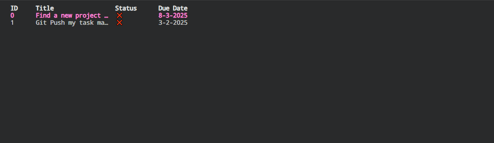

# TeaSK Manager

An a simple GO base task monitor, using bubble tea.


## Build

``` CMD
GO build TeaManagerCLI.go
```

## Location

To use it in every location, all you need is to move the *".exe"* to a folder on your pc.
Then add the folder to your system environment variables as a new **Path**
Then to run it call it

``` CMD
TMC
```
> [!NOTE] I change my .exe to 'TMC.exe'




## Data

TeaSK Manager use a .gt file located in  "User\Documents" in folder called **TeaSK**
